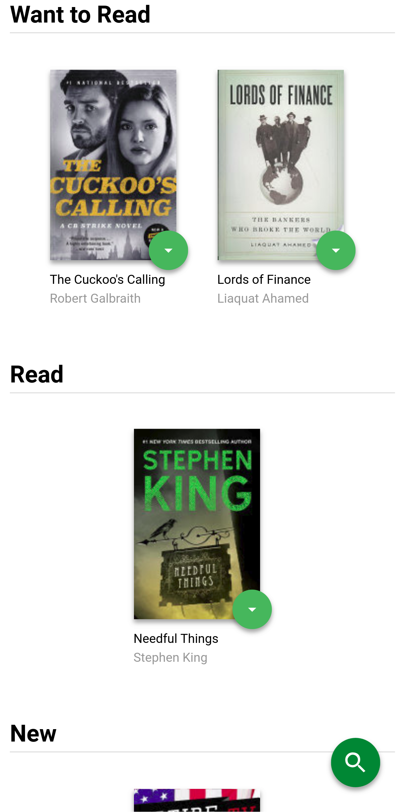
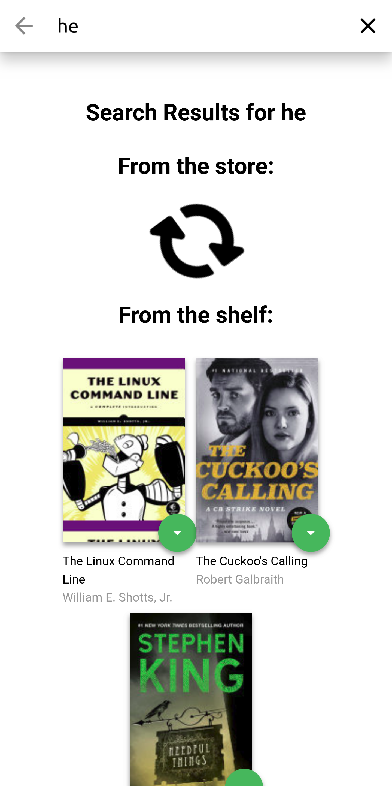
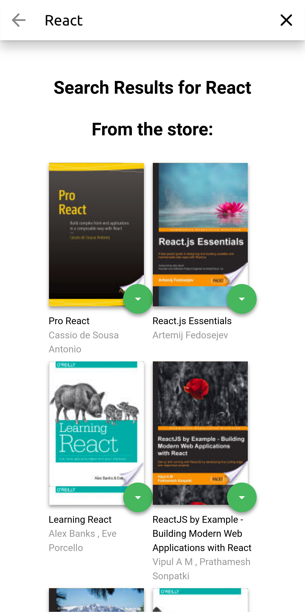

# MyReads Project

A simple react app I made to understand react, part of Udacity's FrontEnd Developer Nanodegree 

## Demo 
### [https://jatindhankhar.in/reactnd-project-myreads-starter](https://jatindhankhar.in/reactnd-project-myreads-starter)

## How to Run

To run right away:

* install all project dependencies with `npm install`
* start the development server with `npm start`
* Visit [http://localhost:3000](http://localhost:3000)
* To generate a static deployable version `npm run build`

## How it Looks

 | | 
--- | --- | ---

## Important
The backend API uses a fixed set of cached search results and is limited to a particular set of search terms, which can be found in [SEARCH_TERMS.md](SEARCH_TERMS.md). That list of terms are the _only_ terms that will work with the backend, so don't be surprised if your searches for Basket Weaving or Bubble Wrap don't come back with any results.

## Create React App

This project was bootstrapped with [Create React App](https://github.com/facebookincubator/create-react-app). You can find more information on how to perform common tasks [here](https://github.com/facebookincubator/create-react-app/blob/master/packages/react-scripts/template/README.md).